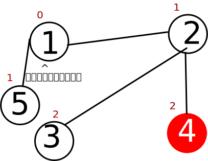
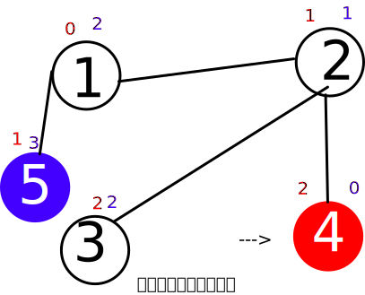
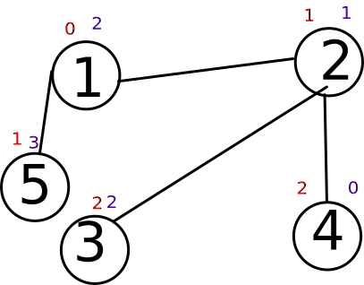

# bibouroku-atcoder
自分の備忘録。atcoderで使えるやつをreadmeにまとめる

# コピペ一覧

```
上下左右移動
((-1, 0), (1, 0), (0, 1), (0, -1))
上下左右斜め移動
((-1, 0), (1, 0), (0, 1), (0, -1), (-1, -1), (1, 1), (-1, 1), (1, -1))
x1,y1,x2,y2のマンハッタン距離
abs(x2-x1)+abs(y2-y1)
x1,y1,x2,y2の斜め移動含みの距離
max(abs(x2-x1),abs(y2-y1))
```

# 出やすいアルゴリズム

|abc|c問題のアルゴリズム|d問題のアルゴリズム|
| ---- | ---- | ---- |
|400|式の変形|ダイクストラ法|
|401|前を引き、後ろを足す|場合分け|
|402|更新|数学|
|403|データごとのフラグと<br>すべてのデータのフラグを用意する|動的計画法|
|404|Union-Find|3<sup>n</sup>回の***全*** ***通*** ***り***|
|405|事前に求める|BFS|
|406|ランレングス圧縮|列ごとのフラグと行ごとのフラグ|
|407|計算|HW回の***全*** ***通*** ***り***|

重要度というのは私自身の数値です、100だと必須、1だといらないぐらいの感じです。

細かいことを言うと100だと***重要度 100***, 70以上だと*重要度 70*, その他だと重要度 4みたいになります。

# 章1 アルゴリズム(コード有り)

# イモス法

***重要度 100***

*タグ:合計,切り替え,sum,リスト,スワップ,swap,文字列入れ替え,入れ替え,事前に求める,切り替え*

aが{1, 2, 3}とかだとして、aの0から2番目を見たいとかそういう全体のうちの少しを使う時に使う。

b<sub>n</sub> = b<sub>n-1</sub> + a<sub>n</sub>

そしてb[参照する最後]-b[参照する最初]がそのうちの結果になる。

pythonのコード：
```python
a=[1,2,3]
b=[]
Counting=0
for i in a:
  b.append(i+Counting)
  Counting+=i
# --- Example --- #
print(b[2]-b[0])
```
c++のコード：
```cpp
#include <iostream>

int main() {
  int l=3;
  int a[100] = {1, 2, 3};
  int b[100];
  int Counting = 0;
  for(int i=0; i<l; i++) {
    b[i]=a[i]+Counting;
    Counting+=a[i];
  }
  // --- Example --- //
  printf("%d\n", b[2]-b[0]);
  return 0;
}
```

# heapq

***重要度 100***

*タグ:リスト,追加,削除,消す,二分探索*

ソートされた状態で~~数値しか扱えないリスト。~~ 使うリスト。

追加 => heapq.heappush(list, n)

最小値をn個 => heapq.nsmallest(n, list)

最大値をn個 => heapq.nlargest(n, list)

最小値を取り出す => heapq.heappop(list)

pythonのコード：
```python
import heapq
l=[0, 2, 3]
print(heapq.heappop(l)) # 0
heapq.heappush(l, 10)
print(heapq.nlargest(3, l)) # [10, 3, 2]
```

# 二分探索法

**重要度 80**

*タグ:リスト,search,サーチ,bisect,found,見つける*

{0,1,2,3}の中で2はどこのうちに入るか、がわかる方法です。

pythonだとbisectが便利すぎる。

pythonのコード(bisect)：
```python
import bisect
def search(array,num):
  return bisect.bisect(array,num)
# --- Example --- #
print(search([0, 1, 3, 5], 4))
```
C++のコード(vector)：
```cpp
#include <iostream>
#include <vector>
using namespace std;
int search(std::vector<int> v, int num) {
  int l=0;
  int r=v.size()-1;
  while(l<=r) {
    int mid=l+(r-l)/2;

    if (v[mid] == num) {
      return mid;
    }
    else if(v[mid] > num) {
      r=mid-1;
    }
    else {
      l=mid+1;
    }
  }
  return l;
}
int main() {
  printf("%d\n", search({0, 1, 3, 5}, 4));
}
```

# Union Find

**重要度 95**

*タグ:くっつける,合体,マージ*

くっつけたりできるやつ。

pythonのコード：
```python
class UnionFind:
    def __init__(self, n):
        self.parent = list(range(n))
        self.size = [1] * n
        self.groupsnum = n

    def find(self, x):
        if self.parent[x] != x:
            self.parent[x] = self.find(self.parent[x])  # 経路圧縮
        return self.parent[x]

    def unite(self, x, y):
        x_root = self.find(x)
        y_root = self.find(y)
        if x_root == y_root:
            return
        if self.size[x_root] < self.size[y_root]:
            x_root, y_root = y_root, x_root
        self.parent[y_root] = x_root
        self.size[x_root] += self.size[y_root]
        self.groupsnum -= 1

    def issame(self, x, y):
        return self.find(x) == self.find(y)

    def __str__(self):
        from collections import defaultdict
        groups = defaultdict(list)
        for i in range(len(self.parent)):
            groups[self.find(i)].append(i)
        return "\n".join(map(str, groups.values())) + f"\n{self.groupsnum} groups found."
```
***速報！！！！pythonにもdsuがあった！！！！ pythonのコード(atcoderでしか使えない)：***
```python
from atcoder.dsu import DSU

uf=DSU(2)

print(uf.same(0,1)) #False
uf.merge(0, 1)
print(uf.same(0,1)) #True
```
***C++のコード(ATCODERでしか使えない)***
```cpp
#include <iostream>
#include "atcoder/dsu.hpp"
int main() {
  atcoder::dsu uf(2);
  printf("%d\n",uf.same(0, 1)); // 0
  uf.merge(0, 1);
  printf("%d\n",uf.same(0, 1)); // 1
  return 0;
}
```

# 1からnumまでの和

**重要度 90**

*タグ:数字,公式*

pythonのコード:
```python
num = 10
ans = num*(num+1)//2
print(ans) # 55
```

C++のコード：
```cpp
#include <iostream>
int main() {
  int num = 10;
  int ans = num*(num+1)/2;
  printf("%d\n",ans); // 55
  return 0;
}
```

# 等差数列の和

*重要度 80*

S<sub>n</sub> = (a<sub>1</sub> + a<sub>n</sub>) * (n / 2)

pythonのコード:
```python
a=[1, 4, 7, 10, 13]
n=4
#                     v 0-indexedから1-indexedに変換
ans=int((a[0]+a[n])*(n+1)/2)
print(ans) # 35
```
C++のコード:
```cpp
#include <iostream>
int main() {
  int a[5]={1, 4, 7, 10, 13};
  int n = 4;//           v 0-indexedから1-indexedに変換
  int ans = (a[0]+a[n])*(n+1)/2;
  printf("%d\n",ans); // 35
  return 0;
}
```

# dfs

***重要度 100***

*タグ:深さ優先,探索,迷路,参照,そこから行ける*

bfsの深さ優先版。

迷路を解くのに最適。最悪計算量O(n)は強すぎ

pythonのコード：
```py
G=[<Places you can go to from Node i>]
ok=[False]*<Node>
startpos=0
ok[startpos]=True
def dfs(v):
  ok[v]=True
  for vv in G[v]:
    if not ok[vv]:
      dfs(vv)
dfs(startpos)
print(ok)
```
C++のコード：
```cpp
/* 気が向いたら翻訳する */
```

# dijkstra法

*重要度 70*

*タグ:迷路,木,経路,コスト,dp*

~~何なんだよこのスペル~~

迷路とかをコスト含んでできる方法です。

pythonのコード：
```python
class dijkstra:
  def __init__(self, ways:list):
    self.ways=ways
  def calc(self, startpos=0):
    import heapq
    h = [(0, startpos)]
    distance = [float('inf')] * len(self.ways)
    distance[startpos] = 0
    while h:
      dist, pos = heapq.heappop(h)
      if dist > distance[pos]:
        continue
      for neighbor, weight in self.ways[pos]:
        if distance[pos] + weight < distance[neighbor]:
          distance[neighbor] = distance[pos] + weight
          heapq.heappush(h, (distance[neighbor], neighbor))
    return distance
d = dijkstra([ 
 [[1, 10], [2, 3]],
 [[0, 10], [3, 2]],
 [[0, 3], [1, 4], [3, 8], [4, 2]],
 [[1, 2], [2, 8], [4, 7]],
 [[2, 2], [3, 7]]
])
print(d.calc())
```
C++のコード：
```cpp
/* 気が向いたら翻訳する */
```

# LazySegTree

*重要度80*

*タグ:segment,tree,lazy,最大値,最小値*

緑コーダーになったら理解したい。と思ったけど灰色で理解した。

ここに解説を書いておく。

遅延演算 : 取得したいときしかしない計算。

op : もし二つのノードがあったとき、上に何を書き込むか

mapping : 遅延演算。もともとの数字から何を計算するか。

composition : 遅延演算その二。遅延演算同士で何に更新するか。

単位元 : a + bの演算に +0しても変わらないでしょ？その0が単位元。掛け算だったら1。

遅延演算の単位元 : 単位元とほぼ同じ。遅延演算同士の単位元。

~~まーーじでわかんなかった。~~

***pythonのコード(ATCODERでしか使えない)***:
```python
from atcoder.lazysegtree import LazySegTree
def op(x, y):
    # x, y は (sum, length) のタプル
    return (x[0] + y[0], x[1] + y[1])
def e():
    return (0, 0)
def mapping(f, x):
    return (x[0] + f * x[1], x[1])
def composition(f, g):
    return f + g
def idn():
    return 0

a = [(v, 1) for v in [1, 2, 3, 4, 5]]

seg = LazySegTree(op, e(), mapping, composition, idn(), a)

print(seg.prod(0, 3)[0]) #6
seg.apply(0, 3, 10)
print(seg.prod(0, 3)[0]) #36
```
C++のコード:
```cpp
/* 気が向いたら翻訳する */
```

# 累積和

***重要度 100***

*タグ:グリッド,二次元,足し合わせる*

pythonのコード:
```python
class Prefix2DSum:
    def __init__(self, board):
        self.board = board
        self.h = len(board)
        self.w = len(board[0])
        self.update()

    def update(self):
        self.pboard = [[0] * (self.w + 1) for _ in range(self.h + 1)]
        for i in range(self.h):
            for j in range(self.w):
                self.pboard[i+1][j+1] = (
                    self.board[i][j]
                    + self.pboard[i][j+1]
                    + self.pboard[i+1][j]
                    - self.pboard[i][j]
                )

    def getarea(self, sx, sy, ex, ey):
        return (
            self.pboard[ey][ex]
            - self.pboard[sy][ex]
            - self.pboard[ey][sx]
            + self.pboard[sy][sx]
        )
```

C++のコード:
```cpp
/*気が向いたら翻訳する*/
```

# sortedcontainers.SortedList

pythonだけ。c++にもあるのかな？

ソートした状態でリストを操作できるもの。~~heapqとの違いはわからん~~

pythonのコード：
```python
#リストだと
list1=[0, 1, 2]
#追加
list1.append(6)
#削除
#bisect使ったほうが早いけど
del list1[list1.index(2)]


#sortedcontainers.SortedListだと
import sortedcontainers
scs = sortedcontainers.SortedList([0, 1, 2])
#ここで制限を変える。大きいリストだとその分大きい数にする。初期値は1000
scs._reset(3)
#追加
scs.add(6)
#削除
scs.discard(2)
```
C++のコード：
```cpp
/*どうやって作るのかわからん*/
```

# 進数変換

***10進数以下しか使えません。***

int型をlistにする。具体的には

13(10) => 1101(2)

にするコード

pythonのコード：
```python
#https://qiita.com/omakasessan/items/4a908da8e3fc7e151d0eのコードを丸パクリしてます。ごめんなさい

def base_n_to_10(n, string):
  string = string[::-1]
  n10 = 0
  for digit in range(len(string)):
    if int(string[digit]) >= n:
      print(f"{n} 以上の数字が混ざっています", end=" ")
      return "error."
    n10 += n ** digit * int(string[digit])
  return n10

def base_10_to_n(n, num):
  n_str = ""
  while (num >= n):
    n_str += str(num % n)
    num //= n
  n_str += str(num)
  n_str = n_str[::-1]
  return n_str
```
C++のコード：
```cpp
/*気がry*/
```

# 三角形の面積

*重要度 80*

*タグ:一直線,三角,triangle,面積,形,形状*

名前でもう分かるでしょう。

pythonのコード：
```py
ax,ay,bx,by,cx,cy = map(int, input().split())
ans = ax*(by-cy)+bx*(cy-ay)+cx*(ay-by)
print(ans)
```
C++のコード：
```cpp
#include <iostream>
using namespace std;
int main() {
  int ax,ay,bx,by,cx,cy;
  cin >> ax >> ay >> bx >> by >> cx >> cy;
  ans = ax*(by-cy)+bx*(cy-ay)+cx*(ay-by);
  printf("%d\n", ans);
  return 0;
}
```
[これをつかった問題](https://atcoder.jp/contests/abc224/tasks)

[その答え 解説](https://atcoder.jp/contests/abc224/editorial/2810)

# 木の距離

~~画像を使おうとしてbase64に変換してできなかった~~

もしダークモードになっていたら、chromeなら新しいタブで画像を開く

を押してください。新しいタブで開くではありません。

---

---

---

---

---

---

---

---
**画像が読み込めなかった人用、またはわからなかった人用のテキスト**
```
f(x)を
if a[x] == max(a[x],b[x]):
  print(max(a))
else:
  print(max(b))
とする。

1<=p<=n
点1からの点pまでの最短距離をすべて出す。
その結果をaとして、
aで一番距離が多かった方からまた点pまでの最短距離をすべて出す。
その結果をbとすると、
点xから行ける一番遠い点は、f(x)
```

[これをつかった問題](https://atcoder.jp/contests/abc428/tasks/abc428_e)

# 章2 考え方(コードなし)

# 2次元を1次元にして考える

***重要度 100***

*タグ:dimension,考え方,dp,動的計画法,2d,1d*

考え方の話。ここからアルゴリズムではない。

具体的には
||||
|----|----|----|
|0|0|0|
|0|1|1|
|0|0|2|

を

||
|----|
|0|
|1|
|2|

右列だけにしてソートする、みたいな感じです。

その他にも使い道はたくさん

例題: [abc129_d](https://atcoder.jp/contests/abc129/tasks/abc129_d) [abc149_c](https://atcoder.jp/contests/abc419/tasks/abc419_c)

# 逆にして考える

迷路を逆から解くみたいな感じ

終点はここでそこにたどり着けるマス数とかを

終点を始点にして考えてあとはdfsでいける

# やらなくてもいいことには甘えろ

やらなくていいことはやらなくていいということです。

どのようにするかというと

|    |    |    |    |
|----|----|----|----|
|やる|やる|やる|やる|
|やる|やる|やる|やる|
|やる|やる|やる|やる|
|やる|やる|やる|やる|

だとTLE( O(W*H) )するけど、

|    |    |    |    |
|----|----|----|----|
|やる||||
||やる|||
|や|ら|な|い|
|||やる|やる|

にすればO(W+H)でACするみたいなことがある。

~~426cでわからされた~~

例題: [abc426_c](https://atcoder.jp/contests/abc426/tasks/abc426_c)

# 商品のクーポンとか

縦、もしくは横の数値が10^9とかでtleだ！！

みたいなときに、

```txt
まず全体の合計を取る。これをaとする。
そして(全体//クーポン一つおきの割り引き)する。その値を合計したものをbとする
min(b, クーポンの残りの個数)する。これをcとする。
クーポンの残りの個数-=cする
そして(全体 mod クーポン一つおきの割り引き)する。その値をリストにしたものをdとする
dを多い順にソートする。
dを多い順にクーポンの残りの個数みて、それを合計する。その値をeとする。
クーポン一つおきの割り引きをfとする。
答えはa-(c*f)-eになる。違ったらissuesに
```

例題：[abc246_c](https://atcoder.jp/contests/abc246/tasks/abc246_c)

# 小さいnには2<sup>n</sup>

単純にnが10ぐらいなら3<sup>n</sup>か2<sup>n</sup>か

意外と使える全探索

# -a-b

単純part2。

***二人の問題で交互にとってポイントは自分-相手で、ポイントを最大化する問題なら-a-b***

というぐらいかな。限定的すぎるけど、つまり

|||
| ---- | ---- |
|1|2|
|2|2|
|3|2|

みたいなポイントだったら

||
| ---- |
|-1-2|
|-2-2|
|-3-2|

になって

||
| ---- |
|-3|
|-4|
|-5|

になる。これをソートして選ぶとすべて***良くなる！！***

まあシンプルに限定的だけど思いつきにくい問題です。

[~~悪銭苦闘したnikkei2019c~~](https://atcoder.jp/contests/nikkei2019-qual/tasks/nikkei2019_qual_c)

